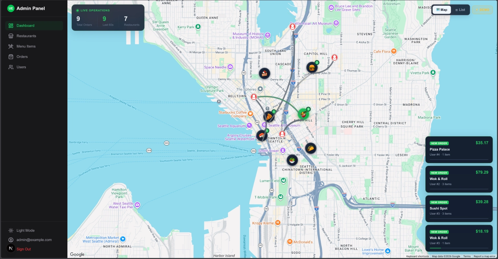

# Uber Eats App Clone Ready To Deploy, Customize and Monitize.

“Normally cloning Uber Eats takes weeks — even with AI.
But I already built it for you.
You just deploy and start making money.”


## Mobile App

The mobile application is a high-performance, cross-platform app built with React Native and Expo. It provides a complete e-commerce experience.

- Features
    - **Authentication**: Secure login and registration using Firebase Auth.
    - **Home Screen**: Dynamic banner carousel, deals, bestsellers, and category navigation.
    - **Product Details**: Image galleries, price info, ratings, reviews, and related products.
    - **Cart & Checkout**: Full cart management, shipping calculation, and secure checkout flow.
    - **Search**: Advanced search with debouncing, filtering (price, category, brand), and sorting.
    - **User Profile**: Order history, address management, and wishlist.
    - **Reviews**: User-generated ratings and reviews.

- Tech Stack
    - **Framework**: React Native (Expo SDK)
    - **Navigation**: Expo Router (File-based routing)
    - **UI Library**: Gluestack UI (for accessible, styled components)
    - **Styling**: NativeWind (Tailwind CSS for React Native)
    - **State Management**: React Context (Auth, Cart, Wishlist)
    - **Backend Integration**: Firebase SDK

## Backend

The backend powers the data and business logic, leveraging Firebase's serverless infrastructure.

- Features
    - **Database**: Firestore for storing users, products, orders, reviews, etc.
    - **Seeding**: `seed.js` script to populate the database with demo data (products, categories, reviews).
    - **Serverless Functions**: Firebase Cloud Functions for complex logic.
    - **Security**: Firestore Rules (`firestore.rules`) to secure data access.

- Tech Stack
    - **Runtime**: Node.js
    - **Database**: Firebase Firestore
    - **Admin SDK**: Firebase Admin SDK (for seeding and admin tasks)
    - **Functions**: Firebase Cloud Functions

## Admin Panel

A modern web-based administration dashboard to manage the platform.

- Features
    - **Dashboard**: Overview of sales, orders, and user activity.
    - **Product Management**: Add, edit, and remove products.
    - **Order Management**: View and update order statuses.

- Tech Stack
    - **Framework**: Next.js
    - **Styling**: Tailwind CSS
    - **Language**: TypeScript

## How to Deploy
Fork [https://github.com/basir/ubereats-clone](https://github.com/basir/ubereats-clone) and open it in VS Code.

### Backend

1.  **Create a Firebase Project**: Go to the [Firebase Console](https://console.firebase.google.com/) and create a new project.
2.  **Enable Services**:
    - **Authentication**: Enable Email/Password provider.
    - **Firestore Database**: Create a database in production mode.
    - **Storage**: Enable if you plan to upload images.
3.  **Install Firebase CLI**:
    ```bash
    npm install -g firebase-tools
    ```
4.  **Login**:
    ```bash
    firebase login
    ```
5. **Get Stripe Secret Key** : Go to the [Stripe Console](https://dashboard.stripe.com/) and copy your stripe secret key.
6. **Deploy**:
    Navigate to the `backend` folder:
    ```bash
    cd backend
    npm install
    cd functions
    npm install
    cd ..
    # make sure you enabled Blaze plan in your firebase project before deploying
    npm run deploy
    # enter STRIPE_SECRET_KEY in the prompt
    ```
7.  **Create Service Account**:
    - Go to the [Firebase Console](https://console.firebase.google.com/)
    - Navigate to Project Settings > Service Accounts
    - Click on "Generate New Private Key"
    - Download the JSON file
    - Save the JSON file in the `backend` folder
    - Add FIREBASE_SERVICE_ACCOUNT_PATH to `backend/.env` with the path to the JSON file
8. **Seed Data**:
    ```bash
    npm run seed
    ```

### Admin Panel

1. Open https://console.firebase.google.com and create web app.
2. Duplicate admin/.env.example and update as admin/.env.local and update values. 
3. Open cloud.google.com and enable Map Api and Direction Api on this key.
4. Open [Vercel](https://vercel.com) and create vercel account
5. Click add project and select the forked repo
6. Enter this settings:
    - root directory: admin
    - framework: Next.js
7. Copy Environment Variables based on admin/.env.local
8. Click deploy
9. Open https://your-admin-panel.vercel.app


### Mobile App

In this section, we will generate mobile app for web, android and ios. 
1. Duplicate `mobile/.env.example` as `mobile/.env.local` 
2. On https://console.firebase.google.com create ios and android apps:
    - Web App: download the config file and update `mobile/.env.local`:
    ```
    EXPO_PUBLIC_FIREBASE_AUTH_DOMAIN=
    EXPO_PUBLIC_FIREBASE_PROJECT_ID=
    EXPO_PUBLIC_FIREBASE_STORAGE_BUCKET=
    EXPO_PUBLIC_FIREBASE_MESSAGING_SENDER_ID=

    EXPO_PUBLIC_FIREBASE_API_KEY_ANDROID=
    EXPO_PUBLIC_FIREBASE_APP_ID_ANDROID=

    EXPO_PUBLIC_FIREBASE_API_KEY_IOS=
    EXPO_PUBLIC_FIREBASE_APP_ID_IOS=
    ```
3. Open cloud.google.com and enable Map Api and Direction Api on both apps keys.
4. Get stripe publishable key from stripe dashboard and update `mobile/.env.local`
    ```
    EXPO_PUBLIC_STRIPE_PUBLISHABLE_KEY=
    ```

#### Android App

For this section, you need to have an Android device.
1. Connect Your Android device to Computer via USB cable and enable debugging
3. Install Android Studio
4. In your project (mobile folder):
    ```bash
    npx expo run:android
    ```

##### Publish Android App to Google Play
1. Generate `.aab` file
    ```bash 
        npx expo prebuild -p android
        cd android
        ./gradlew bundleRelease
        
    ```
    - Output at android/app/build/outputs/bundle/release/app-release.aab

2. Submit `.aab` to [Google Play Console](https://play.google.com/console):
  
#### iOS App
For this section, you need to have a Mac computer and an iPhone.
1. Connect Your iOS device to Computer via USB cable:
3. Install Xcode
4. In your project (mobile folder):
    ```bash
    npx expo run:ios
    ```


## How to Develop

### Prerequisites
- Node.js installed.
- Expo Go app on your phone (for mobile testing).

### Mobile App
1.  Navigate to the mobile folder:
    ```bash
    cd mobile
    ```
2.  Install dependencies:
    ```bash
    npm install
    ```
3.  Start the development server:
    ```bash
    npm start
    ```

### Backend
1.  Navigate to the backend folder:
    ```bash
    cd backend
    ```
2.  Install dependencies:
    ```bash
    npm install
    ```
3.  Run the seed script (optional, to reset data):
    ```bash
    npm run seed
    ```

### Admin Panel
1.  Navigate to the admin folder:
    ```bash
    cd admin
    ```
2.  Install dependencies:
    ```bash
    npm install
    ```
3.  Start the development server:
    ```bash
    npm run dev
    ```
    Open [http://localhost:3000](http://localhost:3000) in your browser.

